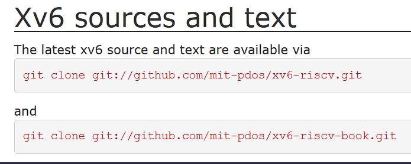
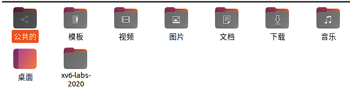
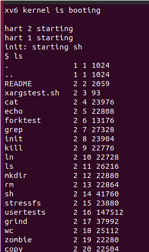
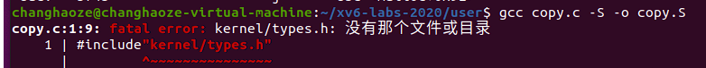
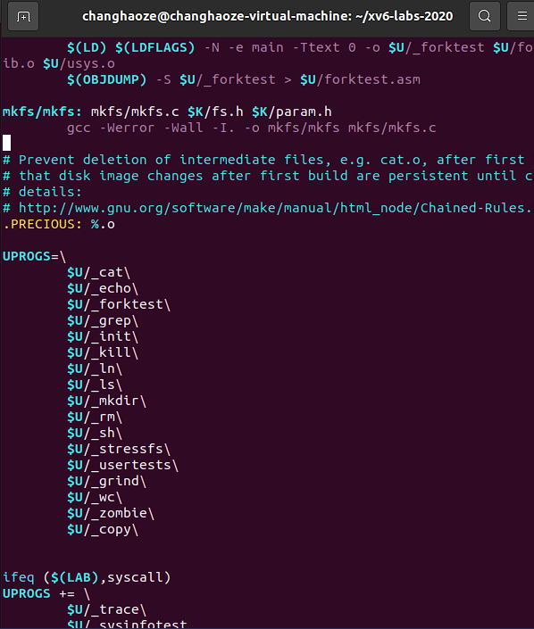
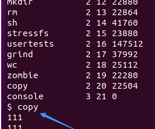

------
# MIT 6.S081lab experiment environment setup guidance
本人小白，在这个课程开始听的很蒙，如果你也感觉很多地方找不到参考欢迎看这个手把手教程：
1.qemu是什么：可以参考 https://zhuanlan.zhihu.com/p/72484589
qemu我们可以认为是一个虚拟机，比如我们在win环境下使用ubuntu，需要一个虚拟机，那么在linux下使用xv6，也需要一个模拟机
2.xv6是什么：可以参考：https://th0ar.gitbooks.io/xv6-chinese/content/
xv6是一个操作系统。

那么lab的过程很清楚了：
window下使用VMware模拟linux = linux下使用qemu模拟xv6

所以我们要两步走：
1.安装模拟器 2.配置虚拟机
# 1.安装模拟器：

```cpp
sudo apt-get install git build-essential gdb-multiarch qemu-system-misc gcc-riscv64-linux-gnu binutils-riscv64-linux-gnu 
```
完全按照官方教程即可

# 2.配置虚拟机：
在终端中输入：


就会发现多了一个xv6文件：


cd 进入该文件中，然后

```cpp
make qemu
```
即可打开虚拟机，类似


那么老师的第一个命令时copy命令，但是我们这里没，我们还会发现我们缺少很多命令比如fork()，sleep() .等

# ** 因为我们实验的目的是模拟一个操作系统，我们需要自己写这些系统调用**
# 3.配置命令-copy举例
1.在user文件中新建copy.c,按照官网的example写好，此时只有一个c文件，xv6还不能执行，需要编译为asm文件
2.编译：


因为头文件和该文件不在一个文件夹中：
3.修改makefile：


在makefile编译文件中修改这里，增加我们增加的c文件名字
4.make clean
5.make qemu

发现：


而且命令是好用的
# 结束！


