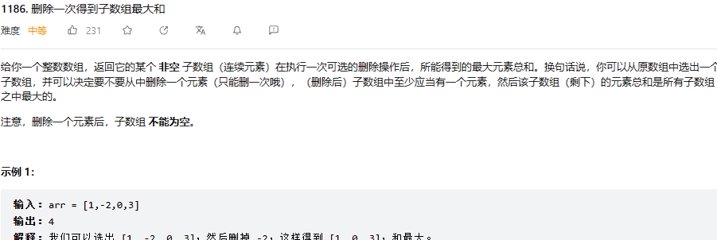

# 贪心算法学习记录：
## 贪心算法简介：能从局部最优解推出全局最优解
一般找找局部最优解，看看能不能推出，或者看看找不找到反例，找不到就可以贪心。
如

有的时候我选入一个负数，但是我能在这个基础上选入更多整数使得整体最大，此时就不能贪心，因为贪心要求不能入选负数。
### 题目类型：
#### 1，分发饼干，加油站，柠檬水找零
此类题目一般是对数组进行操作后看符不符合要求，比如分发饼干，每次对一个胃口最大的孩子给最大的饼干。
局部最优：

#### 2.跳跃游戏，最少数量箭，无重叠区间，合并区间：
此类题目一般是操作一个范围，看范围是否满足自己的题目需求。
局部最优：每步的范围最优
全局最优：全局范围最优

#### 3.数组的某些特性：摆动序列，单调递增数组
删除单调区间
局部最优：每区间都是摆动的
全局最优：整体是摆动区间

 单调递增数字：
 局部最优：每次从后向前找到最远处的不符合要求的位置
 全局最优：找到的递增数最大

#### 4.买卖股票时机，
最大子序和，K次取反后最大化数组和
局部最优：局部最大
全局最优：全局最大

#### 5.重建队列
两个指标：分开贪心两次
